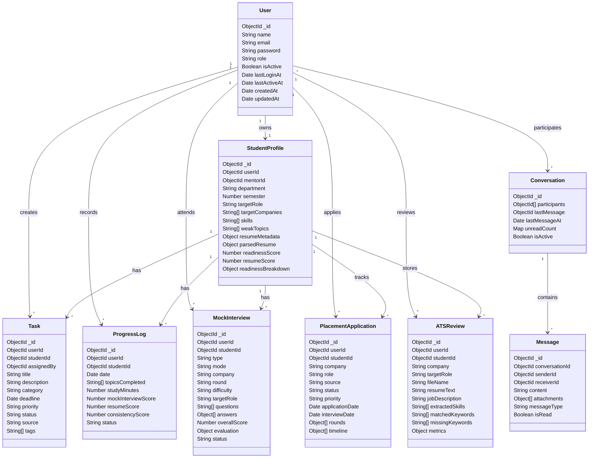
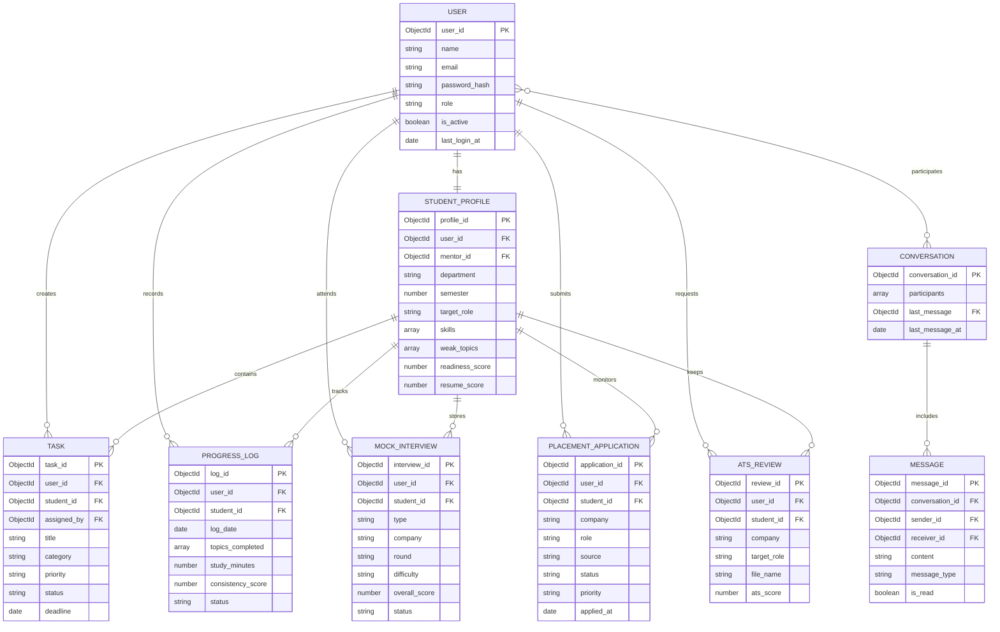

# AI-Powered Placement Preparation and Student Progress Tracker

## Project Report

**Course:** Database Management Systems  
**Project Type:** MERN stack database application  
**Database:** MongoDB with Mongoose ODM  
**Prepared by:** ________________________  
**Register Number:** ____________________  
**Department:** _________________________  
**Institution:** _________________________  

> Note for final submission: add screenshots from your own running application, your college formatting, and your own name/register details. This draft is written specifically around this project so it should not read like a generic copied report.

<div style="page-break-after: always;"></div>

## Abstract

The project, **AI-Powered Placement Preparation and Student Progress Tracker**, is a database-backed web application designed to help students prepare for campus placements in a more organized way. In many colleges, placement preparation happens through scattered spreadsheets, informal WhatsApp reminders, individual notes, and separate mock interview records. This makes it difficult for a student to understand progress clearly, and it also makes it hard for mentors or placement coordinators to track readiness across many students. The application solves this problem by storing student profiles, placement goals, resume details, tasks, mock interviews, progress logs, applications, mentor communication, and analytics in a structured database.

The system is built using the MERN stack. React and Vite are used for the frontend interface, Express.js and Node.js handle the backend API, and MongoDB stores the application data. Mongoose schemas define the logical structure of the database collections and provide validations, relationships, indexes, and embedded subdocuments. The project also includes AI-assisted features such as resume analysis, mock interview question generation, answer evaluation, ATS review, and personalized preparation guidance. Even though AI is part of the application, the database remains the central component because every meaningful action in the system depends on storing, retrieving, updating, and analyzing records.

The database design follows a document-oriented approach. Core entities such as users, student profiles, tasks, progress logs, mock interviews, placement applications, ATS reviews, conversations, and messages are modeled as separate collections. Some repeating details, such as interview answers, application rounds, timeline events, resume versions, and evaluation metrics, are stored as embedded documents because they naturally belong to a parent record. References are used where independent records need to be connected, for example linking a student profile to a user or linking a task to a student.

The final system provides role-based access for students, mentors, and administrators. Students can maintain placement profiles, upload resumes, track tasks, attend mock interviews, view progress, and manage applications. Mentors can monitor student preparation and support students through feedback. Administrators can observe overall placement readiness and activity trends. The result is a practical DBMS project that demonstrates schema design, data relationships, CRUD operations, indexing, authentication, data validation, and real-world use of a NoSQL database in a placement-preparation environment.

<div style="page-break-after: always;"></div>

## 1. Introduction

Placement preparation is not a single activity. It includes aptitude practice, coding practice, resume improvement, mock interviews, company research, communication practice, application tracking, and continuous feedback. A student may be strong in one area and weak in another, but without proper records it becomes difficult to see that clearly. For example, a student may attend three mock interviews, solve coding problems regularly, and update the resume twice, but if all these details are stored separately, the overall progress is not visible. This project was developed to bring these placement-related activities into one database-driven system.

The application is mainly intended for students preparing for campus recruitment, but it also supports mentors and administrators. A student can create a profile with department, semester, target role, target companies, skills, weak topics, resume information, GitHub link, and LinkedIn link. The resume can be uploaded and parsed so that skills and projects are extracted into the student profile. The student can create preparation tasks and record study progress. Mock interviews can be generated and evaluated, and the scores are stored for future reference. Placement applications can be tracked company-wise, including status, rounds, next action, and timeline events.

From the mentor side, the system supports student monitoring and feedback. Since student information is stored in the database with references to users and profiles, a mentor can view progress and identify students who require extra support. The administrator can use analytics to understand overall readiness, task completion, interview performance, and placement activity. This makes the project useful not only as a personal tracker but also as a small placement-management platform.

The database aspect of this project is important because the project is not just a frontend interface. Almost every screen depends on persistent data. The login system depends on the users collection. The profile page depends on the student profile schema. The task page depends on task records and status fields. The interview page stores generated questions, submitted answers, and evaluation metrics. The application tracker maintains company-wise recruitment progress. The dashboard is generated from stored data such as progress logs, readiness scores, interview scores, and task statistics.

MongoDB was selected because the project contains both structured and semi-structured data. For example, a user account has fixed fields such as name, email, password, and role. However, a mock interview can contain a flexible list of answers, each with scores, feedback, voice metrics, and visual metrics. A placement application can contain multiple rounds and timeline events, and each company may have a different number of rounds. MongoDB handles these nested structures naturally using documents and arrays. Mongoose adds schema-level discipline on top of MongoDB by defining field types, validations, default values, indexes, and references.

The main objective of the project is to design and implement a database system that can support a realistic placement preparation workflow. The system should reduce manual tracking, provide organized data storage, and help users make decisions based on progress records rather than guesswork.

### 1.1 Problem Statement

Students preparing for placement often use separate tools for different activities: notes for weak topics, spreadsheets for applications, PDFs for resumes, websites for coding practice, and informal chats for mentor feedback. This causes duplication, loss of information, and poor visibility. A mentor or placement coordinator also cannot easily understand which students are ready, which students are inactive, and which areas need improvement. The problem is to design a single database-backed system that stores all major placement preparation data and presents it through a useful web application.

### 1.2 Objectives

- To create a centralized database for student placement preparation.
- To store user accounts with role-based access for students, mentors, and administrators.
- To maintain student profiles with skills, weak topics, target roles, companies, resume details, and readiness scores.
- To track preparation tasks with category, deadline, status, priority, and source.
- To record mock interview sessions, questions, answers, feedback, and performance metrics.
- To store daily or weekly progress logs for preparation consistency.
- To manage placement applications with company, role, status, rounds, and timeline events.
- To support resume upload, parsing, ATS review, and resume history.
- To provide analytics for students and administrators.
- To demonstrate MongoDB schema design, relationships, embedded documents, indexing, and CRUD implementation.

### 1.3 Scope

The scope of the project includes authentication, profile management, task tracking, progress logging, resume analysis, mock interviews, placement application tracking, notifications, mentor-student communication, and analytics dashboards. The project can be used in a college placement preparation environment where students want to track their preparation and mentors want a better view of student readiness.

The project does not replace the official placement portal of a college. Instead, it acts as a preparation and monitoring tool. It can be extended later to integrate official company drives, attendance, eligibility criteria, interview schedules, and placement results.

<div style="page-break-after: always;"></div>

## 2. Database Schema Diagram

The database uses MongoDB collections, and the schemas are implemented using Mongoose. Since MongoDB is document-oriented, the design combines referenced relationships and embedded subdocuments. Main records are stored as separate collections when they have independent meaning or need to be queried separately. Smaller repeating records that belong to a parent are embedded inside the parent document.

### 2.1 Main Collections

The main collections used in this project are:

- `users`
- `studentprofiles`
- `tasks`
- `progresslogs`
- `mockinterviews`
- `placementapplications`
- `atsreviews`
- `notifications`
- `conversations`
- `messages`
- `analytics`
- `activities`
- `codingproblems`
- `codingsubmissions`
- `preparationplans`
- `feedbacks`
- `mentornotes`
- `meetingrequests`

The most important collections from the DBMS point of view are described below.

### 2.2 Schema Diagram



### 2.3 Explanation of Schema

The `User` collection stores authentication and role information. Every person using the application is represented as a user. The `role` field separates students, mentors, and administrators. The password is stored in hashed form using bcrypt, so the actual password is not stored as plain text.

The `StudentProfile` collection extends the user account for student-specific placement details. It contains academic information, target companies, skills, weak topics, resume metadata, parsed resume content, readiness score, resume score, coding readiness, communication readiness, and readiness breakdown. The profile is linked to the `User` collection through `userId`. If the student has a mentor, the `mentorId` field links to another user.

The `Task` collection stores preparation tasks. A task may be created by the student or assigned by a mentor. The category field identifies whether the task belongs to aptitude, coding, HR, resume, project, system design, or another area. Priority and status fields help in filtering tasks and generating dashboard summaries.

The `ProgressLog` collection stores preparation activity. It records study minutes, topics completed, mock interview score, resume score, consistency score, notes, and status. This collection is useful for measuring consistency over time.

The `MockInterview` collection stores interview practice sessions. It contains interview type, company, round, difficulty, generated questions, submitted answers, evaluation metrics, strengths, improvements, suggestions, and final score. The answers are embedded because they are meaningful mainly inside a particular interview session.

The `PlacementApplication` collection stores application tracking details. It contains company name, role, source, status, priority, job type, dates, package, rounds, notes, and timeline events. Since each application can have many rounds, rounds are embedded inside the application document.

The `ATSReview` collection stores resume review history. It keeps the resume text, job description, matched keywords, missing keywords, extracted skills, formatting issues, and ATS metrics. This allows the student to compare resume improvements over time.

The `Conversation` and `Message` collections support mentor-student communication. A conversation contains participants and last-message information, while each message stores sender, receiver, content, attachments, read status, and timestamps.

<div style="page-break-after: always;"></div>

## 3. ER Diagram

Although MongoDB is a NoSQL database, an ER-style diagram is still useful for understanding the logical relationships between entities. The ER diagram below represents the conceptual view of the system. In the actual implementation, some child entities are embedded documents, while others are separate collections with references.



### 3.1 Relationship Explanation

The relationship between `User` and `StudentProfile` is one-to-one for students. A user with the role of student will have one profile. Mentors and admins may not require a student profile. The profile contains placement-related information that should not be stored directly inside the user account because user data is mainly for authentication and identity.

The relationship between `StudentProfile` and `Task` is one-to-many. One student can have many preparation tasks. A task can also contain an `assignedBy` field, which points to the mentor or user who created it. This supports both self-created tasks and mentor-assigned tasks.

The relationship between `StudentProfile` and `ProgressLog` is one-to-many. A student can create many progress logs over time. This design helps in generating weekly reports and consistency charts.

The relationship between `StudentProfile` and `MockInterview` is one-to-many. A student can attend many mock interviews. Each mock interview stores questions and answers as embedded arrays because they belong to that interview session.

The relationship between `StudentProfile` and `PlacementApplication` is one-to-many. A student may apply to many companies. Each application can have many rounds and timeline events. These are embedded inside the application because they do not need to exist independently.

The relationship between `Conversation` and `Message` is one-to-many. A conversation can contain many messages. Messages are separate documents because chat history can grow large and must be queried by conversation and time.

<div style="page-break-after: always;"></div>

## 4. Hardware and Software Requirement

### 4.1 Hardware Requirements

The project is a web-based application and does not require specialized hardware. It can run on a normal laptop or desktop during development. For deployment, the backend can run on a cloud service such as Render, and the frontend can run on Vercel. MongoDB Atlas can be used for cloud database hosting.

Minimum hardware requirement for development:

- Processor: Intel i3 or equivalent
- RAM: 4 GB minimum, 8 GB recommended
- Storage: 2 GB free space for source code, dependencies, and logs
- Internet connection: Required for MongoDB Atlas, package installation, and API integrations
- Display: Standard monitor or laptop display

Recommended hardware requirement:

- Processor: Intel i5 or equivalent
- RAM: 8 GB or above
- Storage: SSD with at least 5 GB free space
- Internet connection with stable speed for database access and deployment

The application is not CPU-heavy in normal usage. Most operations are database reads/writes, authentication checks, and API responses. AI-related tasks may take longer because they depend on external services, but the application includes fallback responses if the AI key is not configured.

### 4.2 Software Requirements

Development software:

- Operating System: Windows 10/11, Linux, or macOS
- Node.js: Required to run backend and frontend
- npm: Required for dependency management
- MongoDB Atlas: Cloud database service
- Code Editor: Visual Studio Code or any editor
- Browser: Chrome, Edge, or Firefox
- Git: Optional but useful for version control

Backend technologies:

- Node.js
- Express.js
- MongoDB
- Mongoose
- JSON Web Token for authentication
- bcryptjs for password hashing
- express-validator for validation
- helmet and cors for security and cross-origin access
- multer for resume file upload
- pdf-parse, mammoth, and word-extractor for document text extraction
- socket.io for real-time chat features
- pdfkit for report generation

Frontend technologies:

- React
- Vite
- Axios
- React Router
- Chart.js and react-chartjs-2
- lucide-react icons
- CSS for custom styling

Database software:

- MongoDB Atlas for cloud storage
- Mongoose ODM for schema definition and database operations

### 4.3 Functional Requirements

- The system must allow users to register and log in securely.
- The system must support three roles: student, mentor, and admin.
- Students must be able to create and update placement profiles.
- Students must be able to upload resumes and store parsed resume information.
- Students must be able to create, update, and track preparation tasks.
- Students must be able to record progress logs.
- Students must be able to generate and submit mock interviews.
- The system must store interview scores and feedback.
- The system must allow placement applications to be tracked by company and status.
- The system must support mentor-student communication.
- The system must generate dashboard analytics from stored data.

### 4.4 Non-Functional Requirements

- The system should protect routes using authentication.
- Passwords should not be stored in plain text.
- API endpoints should validate user input.
- Frequently queried fields should be indexed.
- The system should provide meaningful error messages.
- The frontend should be responsive and usable on common screen sizes.
- The database design should avoid unnecessary duplication.
- The project should be maintainable and extendable.

<div style="page-break-after: always;"></div>

## 5. Database Design and Implementation

### 5.1 Database Selection

MongoDB was selected as the database for this project because the data is not purely tabular. A placement preparation system contains nested and flexible information. For example, a mock interview contains many answers, and each answer can have feedback, metrics, follow-up questions, voice metrics, and visual metrics. A placement application can have many rounds, and every company may follow a different process. A resume review can contain arrays of matched keywords, missing keywords, formatting issues, and suggestions. In a relational database, these details may require many separate tables. In MongoDB, they can be represented naturally as documents and embedded arrays.

At the same time, the project still follows proper database design principles. Main entities are separated into collections, references are used where needed, indexes are added for faster querying, and schema validations prevent invalid values. Mongoose is used to define the structure of collections and to maintain consistency in the application layer.

### 5.2 Design Approach

The design uses a combination of referencing and embedding.

Referencing is used when:

- The related data belongs to another independent entity.
- The data may be queried separately.
- The relationship connects two main collections.
- The child records may grow large.

Examples:

- `StudentProfile.userId` references `User`.
- `Task.userId` references `User`.
- `Task.studentId` references `StudentProfile`.
- `Message.conversationId` references `Conversation`.
- `Message.senderId` and `Message.receiverId` reference `User`.

Embedding is used when:

- The child data belongs strongly to the parent.
- The child data is usually retrieved with the parent.
- The child data does not need a separate lifecycle.

Examples:

- `resumeVersions` inside `StudentProfile`.
- `answers` inside `MockInterview`.
- `rounds` inside `PlacementApplication`.
- `timeline` inside `PlacementApplication`.
- `metrics` inside `ATSReview`.

This design keeps the database practical. It avoids too many collections while still allowing important records to be queried efficiently.

### 5.3 User Collection

The `User` collection stores login and identity details. The fields include name, email, password, role, account status, last login time, and last active time. The email field is unique and indexed to support fast login checks. The role field is indexed because role-based queries are common for admin and mentor operations.

The password is hashed before saving using a Mongoose pre-save hook. This is an important security feature because even if database data is exposed, plain passwords are not visible.

Main fields:

- `name`: Name of the user.
- `email`: Unique login email.
- `password`: Hashed password.
- `role`: Student, mentor, or admin.
- `isActive`: Indicates whether the account is active.
- `lastLoginAt`: Stores login time.
- `lastActiveAt`: Stores recent user activity.

### 5.4 Student Profile Collection

The `StudentProfile` collection stores academic and placement-related details. It is linked to the user through `userId`. The profile includes department, semester, target role, target companies, skills, weak topics, resume details, readiness score, and links such as GitHub and LinkedIn.

Resume details are stored in two parts. `resumeMetadata` stores file information such as original name, MIME type, file size, and uploaded date. `parsedResume` stores extracted text and structured information such as name, education, skills, projects, experience, and certifications. The `resumeVersions` array stores previous uploaded versions so that the student can maintain history.

The profile also contains readiness scores. These fields allow the dashboard to show preparation status without recalculating everything on every request.

### 5.5 Task Collection

The `Task` collection represents preparation work. Tasks can be self-created, mentor-assigned, or generated from an AI plan. The category field helps classify tasks into aptitude, coding, HR, resume, project, system design, or other. The status field shows whether the task is pending, in progress, completed, or overdue.

Indexes are added on fields such as `userId`, `studentId`, `priority`, `status`, `source`, and `createdAt`. These indexes help the application quickly load a student's pending tasks, high-priority tasks, and dashboard summaries.

### 5.6 Progress Log Collection

The `ProgressLog` collection stores preparation activity by date. It includes study minutes, topics completed, mock interview score, resume score, consistency score, notes, and status. This collection is useful for showing progress over time. For example, the dashboard can calculate total study time, average consistency, and recent activity.

The `date` field is indexed because progress records are often filtered by time. The `status` field is also indexed for review workflows.

### 5.7 Mock Interview Collection

The `MockInterview` collection stores mock interview sessions. Each document contains the interview type, mode, company, round, difficulty, skill level, target role, questions, answers, evaluation, strengths, improvements, suggestions, delivery metrics, and status.

The `answers` field is an embedded array. Each answer stores the question, student's answer, score, feedback, follow-up question, and metrics. This design is suitable because answers are part of one interview attempt and are usually displayed together.

The collection is indexed by fields such as `userId`, `studentId`, `type`, `mode`, `company`, and `status`. This supports filtering interview history by student, company, round, and interview type.

### 5.8 Placement Application Collection

The `PlacementApplication` collection stores application tracking data. It includes company, role, source, status, priority, location, job type, dates, package, rounds, rejection reason, notes, and timeline.

The `rounds` array stores each recruitment round with name, type, status, scheduled date, completed date, and notes. The `timeline` array stores important events such as applied, online assessment scheduled, technical round cleared, HR round completed, or offer received.

This collection is important because it turns placement applications into structured records instead of scattered notes. It allows students to see which companies are pending, which require action, and which applications are completed or rejected.

### 5.9 ATS Review Collection

The `ATSReview` collection stores resume analysis results. It contains resume text, job description, company, target role, extracted skills, matched keywords, missing keywords, formatting issues, optimization suggestions, role suggestions, keyword groups, and metrics.

This collection is useful because a student may improve the resume multiple times for different companies. By storing review history, the student can compare scores and understand whether the resume is improving.

### 5.10 Conversation and Message Collections

The project includes communication support using `Conversation` and `Message` collections. A conversation stores participants, last message, unread count, and active status. Messages are stored separately because message history can grow large. Each message stores sender, receiver, content, attachments, message type, read status, and deletion status.

This design makes chat retrieval efficient. Messages can be queried by conversation ID and sorted by creation time.

### 5.11 Indexing Strategy

Indexes are used to improve read performance. Some important indexes are:

- `User.email` for login.
- `User.role` for role-based filtering.
- `StudentProfile.userId` for profile lookup.
- `Task.userId`, `Task.studentId`, `Task.status`, and `Task.priority` for task dashboards.
- `ProgressLog.date` for progress reports.
- `MockInterview.userId`, `MockInterview.company`, and `MockInterview.status` for interview history.
- `PlacementApplication.userId`, `PlacementApplication.status`, and text index on company, role, and notes.
- `ATSReview.userId` and created date for review history.
- `Message.conversationId` and created date for chat messages.

Indexes are not added blindly to every field because too many indexes slow down write operations. The project adds indexes mainly to fields used in filtering, sorting, searching, and relationships.

### 5.12 CRUD Implementation

The backend implements CRUD operations through Express controllers and routes.

Examples:

- User registration and login create and read user records.
- Profile update modifies student profile documents.
- Task creation, update, and listing operate on task documents.
- Progress logs are inserted and retrieved for reports.
- Mock interview sessions are created and later updated with submitted answers.
- Placement applications can be created, updated, filtered, and analyzed.
- Resume upload updates student profile and creates resume version history.

The API uses JWT middleware to protect routes. Role middleware ensures that only permitted users can access certain routes. Validation middleware checks request data before it reaches the controller.

<div style="page-break-after: always;"></div>

## 6. Implementation Details

### 6.1 Backend Implementation

The backend is implemented using Node.js and Express.js. The server loads environment variables, connects to MongoDB using Mongoose, configures middleware, and mounts API routes under `/api`. The backend uses modular folders such as config, controllers, middleware, models, routes, services, and utilities.

The `config/db.js` file handles the MongoDB connection. The connection string is stored in the `.env` file. This prevents database credentials from being hardcoded in the source code.

Controllers contain the main request-handling logic. For example, the student controller handles profile retrieval, profile update, progress log creation, resume parsing, resume upload, and resume analysis. The task controller handles task operations. The interview controller handles mock interview creation and answer evaluation.

Services contain reusable logic. For example, the AI service handles question generation and resume review logic, while analytics services calculate dashboard values. Keeping this logic outside controllers makes the code cleaner and easier to maintain.

### 6.2 Frontend Implementation

The frontend is built with React and Vite. It contains pages for login, register, student dashboard, mentor dashboard, admin dashboard, profile, tasks, mock interviews, reports, placement guide, ATS resume lab, application tracker, chat, and coding arena.

Axios is configured in a central API file. The JWT token is added automatically to outgoing requests. This avoids repeating authentication code in every page.

The profile page allows the student to edit placement details and upload a resume. The dashboard pages use charts to show readiness, progress, consistency, and scores. The application tracker gives a structured view of company applications.

### 6.3 Resume Upload and Parsing

Resume upload is handled using multer in the backend. The file is stored in memory and parsed based on its type. Text files are read directly. DOCX files are parsed using document text extraction. PDF files are parsed into readable text. The extracted text is passed to the resume parser, which identifies skills and project-related lines.

The parsed result is stored in the student profile. This is useful because later features, such as mock interviews and ATS analysis, can use resume data without asking the student to upload the resume again.

### 6.4 Authentication and Security

The project uses JWT-based authentication. After login, the backend returns a token. The frontend stores the token and sends it in the Authorization header for protected requests. The backend verifies the token before allowing access.

Passwords are hashed using bcryptjs before storing them in the database. Helmet is used for security headers, CORS controls allowed frontend origins, and rate limiting is used to reduce abuse of API endpoints.

### 6.5 Data Validation

Mongoose schemas define data types, enum values, required fields, minimum and maximum values, and default values. Express-validator is used for request-level validation. For example, task status is limited to defined values, role is limited to student, mentor, or admin, and scores are limited between 0 and 100.

Validation is important because database quality depends on the correctness of inserted data. Without validation, inconsistent status values or missing references can make analytics unreliable.

<div style="page-break-after: always;"></div>

## 7. Results

The completed project provides a working placement preparation management system with a database-driven backend and a responsive frontend. The main result is that student placement data is no longer scattered across different tools. It is stored in a structured format and can be retrieved whenever required.

### 7.1 User Authentication Result

The system supports registration and login. Users are stored in the `users` collection with hashed passwords. Role-based access separates student, mentor, and admin workflows. This result shows that the application can securely identify users and show relevant screens based on their role.

### 7.2 Student Profile Result

Students can maintain department, semester, target role, target companies, skills, weak topics, GitHub link, LinkedIn link, and resume details. The profile data is stored in the `studentprofiles` collection. When a resume is uploaded, extracted skills and projects are stored as part of the parsed resume. This improves the usefulness of the profile because it becomes more than a manual form.

### 7.3 Task Tracking Result

The task module allows students to organize preparation work. Tasks can be categorized and tracked by status and priority. Since tasks are stored in a separate collection, they can be filtered and summarized for dashboards. This helps students understand what is pending and what has been completed.

### 7.4 Progress Tracking Result

Progress logs allow students to record study minutes, topics completed, mock interview score, and resume score. These records can be used to calculate consistency and progress trends. This module is useful because placement preparation depends heavily on regular practice.

### 7.5 Mock Interview Result

The mock interview module stores generated questions, submitted answers, scores, feedback, and suggestions. This creates a history of interview practice. A student can look back at previous sessions and identify repeated weak areas.

### 7.6 Placement Application Tracking Result

The application tracker stores company-wise application progress. Each application can contain status, priority, rounds, next action, dates, and notes. This makes the recruitment process easier to follow, especially when a student applies to multiple companies.

### 7.7 Resume and ATS Review Result

The system stores resume versions and ATS review history. It identifies extracted skills, matched keywords, missing keywords, formatting issues, and improvement suggestions. This helps students improve their resume based on specific target roles and job descriptions.

### 7.8 Analytics Result

The dashboard and reports summarize stored data into useful information. Readiness score, task status, interview performance, progress trends, and resume scores can be displayed visually. This proves that the database design supports not only storage but also analysis.

### 7.9 Expected Screenshots to Add

For final submission, add screenshots from your running project:

- Login page
- Student dashboard
- Profile page with resume upload
- Task page
- Mock interview page
- Application tracker page
- ATS resume lab page
- Analytics or reports page
- MongoDB Atlas collections view
- Sample document from `studentprofiles`

<div style="page-break-after: always;"></div>

## 8. Conclusion

The AI-Powered Placement Preparation and Student Progress Tracker successfully demonstrates the design and implementation of a database-oriented web application. The project solves a realistic problem faced by students during placement preparation: the lack of a single organized system for tracking resumes, tasks, interviews, applications, progress, and feedback.

From a DBMS perspective, the project shows how a real application can be modeled using MongoDB and Mongoose. The database design includes separate collections for independent entities and embedded documents for tightly related data. References connect users, student profiles, tasks, interviews, applications, reviews, conversations, and messages. Indexes improve query performance, while schema validations maintain data consistency.

The project also demonstrates important backend concepts such as authentication, authorization, validation, password hashing, file upload, API design, and analytics generation. The frontend makes the stored data usable through dashboards, forms, charts, and tracking pages. The database is not used only for storing records; it supports decision-making by helping students and mentors understand preparation status.

One of the strengths of the project is that it can be expanded. Future improvements can include official placement drive management, eligibility filtering, attendance tracking, automated mentor assignment, company-specific preparation plans, email reminders, and stronger analytics. The current design already provides a foundation for these extensions because the major entities and relationships are clearly separated.

Overall, the project is a practical DBMS implementation because it connects database design with an actual student workflow. It shows how data modeling, schema implementation, CRUD operations, indexing, and application logic work together in a complete placement preparation platform.

<div style="page-break-after: always;"></div>

## 9. References

1. Abraham Silberschatz, Henry F. Korth, and S. Sudarshan, *Database System Concepts*, McGraw-Hill.
2. Ramez Elmasri and Shamkant B. Navathe, *Fundamentals of Database Systems*, Pearson.
3. MongoDB Documentation, *MongoDB Manual*, https://www.mongodb.com/docs/manual/
4. Mongoose Documentation, *Schemas and Models*, https://mongoosejs.com/docs/
5. Express.js Documentation, *Express API Reference*, https://expressjs.com/
6. Node.js Documentation, *Node.js API Documentation*, https://nodejs.org/docs/
7. React Documentation, *React Learn Documentation*, https://react.dev/
8. OWASP Foundation, *Authentication and Password Storage Guidelines*, https://owasp.org/
9. JSON Web Token Introduction, https://jwt.io/introduction
10. MongoDB, *Data Modeling Introduction*, https://www.mongodb.com/docs/manual/data-modeling/

<div style="page-break-after: always;"></div>

## Appendix A: Collection Summary Table

| Collection | Purpose | Important Fields |
|---|---|---|
| users | Stores login and role information | name, email, password, role, isActive |
| studentprofiles | Stores student placement profile | userId, department, semester, skills, resume, readinessScore |
| tasks | Stores preparation tasks | userId, studentId, title, category, priority, status |
| progresslogs | Stores preparation progress | userId, studentId, date, studyMinutes, topicsCompleted |
| mockinterviews | Stores interview practice sessions | userId, studentId, type, questions, answers, overallScore |
| placementapplications | Tracks company applications | company, role, status, rounds, timeline |
| atsreviews | Stores resume review results | resumeText, jobDescription, matchedKeywords, metrics |
| conversations | Stores chat session metadata | participants, lastMessage, unreadCount |
| messages | Stores individual chat messages | conversationId, senderId, receiverId, content |

<div style="page-break-after: always;"></div>

## Appendix B: Sample MongoDB Documents

### User Document

```json
{
  "_id": "ObjectId",
  "name": "Student User",
  "email": "student@demo.edu",
  "password": "hashed_password",
  "role": "student",
  "isActive": true,
  "createdAt": "2026-05-31T00:00:00.000Z",
  "updatedAt": "2026-05-31T00:00:00.000Z"
}
```

### Student Profile Document

```json
{
  "_id": "ObjectId",
  "userId": "ObjectId",
  "department": "AIML",
  "semester": 4,
  "targetRole": "AI/ML Engineer",
  "targetCompanies": ["TCS", "Infosys", "Zoho", "Accenture"],
  "skills": ["Python", "Java", "JavaScript", "SQL", "React.js"],
  "weakTopics": ["Aptitude", "Dynamic Programming", "Communication"],
  "resumeScore": 72,
  "readinessScore": 68
}
```

### Task Document

```json
{
  "_id": "ObjectId",
  "userId": "ObjectId",
  "studentId": "ObjectId",
  "title": "Revise DBMS normalization",
  "category": "aptitude",
  "priority": "high",
  "status": "in-progress",
  "source": "self",
  "deadline": "2026-06-05T00:00:00.000Z"
}
```

<div style="page-break-after: always;"></div>

## Appendix C: Suggested Page Distribution for Final 20-Page Report

Use this distribution when converting the content to Word:

| Page Range | Content |
|---|---|
| Page 1 | Title page |
| Page 2 | Abstract |
| Pages 3-5 | Introduction, problem statement, objectives, scope |
| Pages 6-8 | Database schema diagram and explanation |
| Pages 9-10 | ER diagram and relationship explanation |
| Pages 11-12 | Hardware and software requirements |
| Pages 13-17 | Database design and implementation |
| Pages 18-19 | Results with screenshots |
| Page 20 | Conclusion and references |

Add screenshots and short explanations after each screenshot. That will naturally bring the final report above 20 pages without stretching the writing unnaturally.
