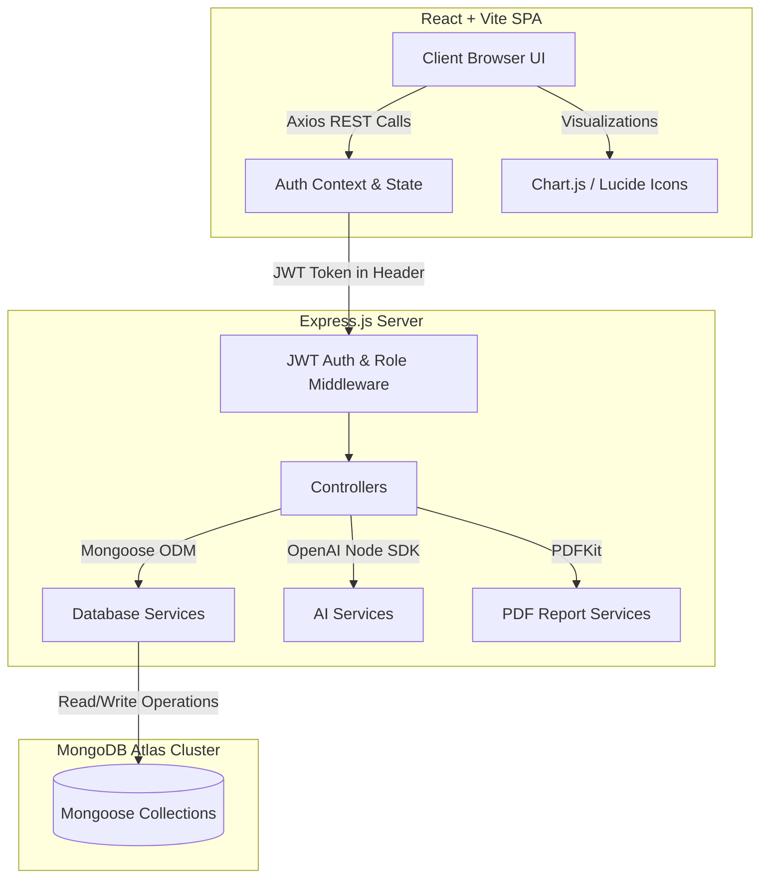
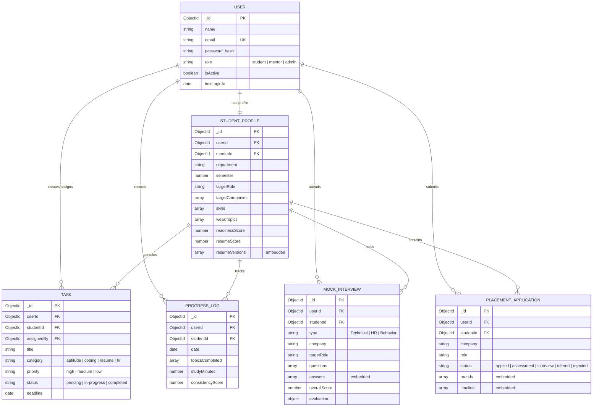

# 🎯 AI-Powered Placement Preparation & Student Progress Tracker

[](https://mongodb.com)
[](https://react.dev)
[](https://nodejs.org)
[](https://www.mongodb.com)
[](https://openai.com)

A production-grade **Database Management System (DBMS)** web application built using the MERN stack. Designed to streamline placement preparation, automate resume analysis, generate AI mock interviews, track tasks, and monitor progress with role-based dashboard metrics for students, mentors, and administrators.

---

## 📖 Table of Contents
1. [Key Features](#-key-features)
2. [Project Architecture](#-project-architecture)
3. [Database Design & Schema](#-database-design--schema)
4. [File & Directory Structure](#-file--directory-structure)
5. [API Endpoint Reference](#-api-endpoint-reference)
6. [Getting Started & Installation](#-getting-started--installation)
7. [Environment Variables](#-environment-variables)
8. [Database Seeding & Demo Credentials](#-database-seeding--demo-credentials)
9. [Deployment Guide](#-deployment-guide)

---

## ✨ Key Features

### 👨‍🎓 Student Portal
*   **Placement Profile:** Custom profile detailing department, target roles, target companies, key skills, and weak topics.
*   **Task Planner & CRUD:** Dynamic checklist categorized by aptitude, coding, resume, system design, HR, etc., with priority indicators.
*   **AI Resume Lab (ATS Score):** Upload resumes to evaluate formatting, extract skills, calculate ATS scores, and find missing keywords.
*   **AI Mock Interviews:** Conduct role-specific mock interviews with real-time feedback, detailed ratings, and suggestions.
*   **Progress Logs:** Log study hours and topics to visualize preparation consistency and readiness metrics.
*   **Application Tracker:** Log and track placement applications across multiple rounds and states (applied, OA, technical, HR, offer, reject).

### 👨‍🏫 Mentor Portal
*   **Student Monitoring:** Direct access to assigned students' profiles, task lists, and mock interview statistics.
*   **Feedback & Meetings:** Schedule virtual reviews and log feedback to guide students on weak topics.
*   **Activity Auditing:** Audit recent student activity logs and check preparation consistency.

### 👑 Admin Portal
*   **Placement Analytics:** Comprehensive analytical view of college-wide readiness, average test scores, and application conversion funnels.
*   **User Management:** Register, update, and manage accounts for students, mentors, and admins.
*   **System Controls:** View API rate-limiting activity and database capacity summaries.

---

## 🏗 Project Architecture

The application is built using a decoupled client-server architecture:



---

## 🗄 Database Design & Schema

Below is the Entity-Relationship (ER) model outlining the collections, attributes, and relationships. It uses a hybrid design representing NoSQL referencing and embedded document arrays.



---

## 📂 File & Directory Structure

```text
DBMS/
├── backend/
│   ├── config/             # Database connection, Cloudinary, and AI API config
│   ├── controllers/        # Business logic for auth, tasks, profiles, interviews, etc.
│   ├── middleware/         # Auth, Error handling, Rate limiting, Role controls, Validator
│   ├── models/             # Mongoose database models (User, Task, Profile, etc.)
│   ├── routes/             # REST API routes
│   ├── services/           # Reusable services (AI calls, analytics math, PDF creation)
│   ├── utils/              # Token helpers, Logger, database seeders
│   ├── .env.example        # Reference for environment configurations
│   ├── package.json        # Node dependencies & run scripts
│   └── server.js           # Server bootstrapper & Express initialization
└── frontend/
    ├── src/
    │   ├── api/            # API base client configuration
    │   ├── charts/         # Consistency, Readiness, and Progress Chart components
    │   ├── components/     # App layouts, Sidebars, Navbar, Modals, Loaders
    │   ├── context/        # User Authentication state provider
    │   ├── forms/          # Login, Registration, and Task forms
    │   ├── pages/          # Core pages (Dashboards, MockInterview, ATS Lab, Tracker)
    │   ├── App.jsx         # App router and layouts configuration
    │   └── main.jsx        # Frontend entry point
    ├── index.html          # Shell HTML
    ├── .env.example        # Vite environment configurations
    └── package.json        # React app dependencies
```

---

## 🔌 API Endpoint Reference

| Method | Endpoint | Description | Auth Required | Role Allowed |
| :--- | :--- | :--- | :---: | :---: |
| **POST** | `/api/auth/register` | Create a new user account | No | Public |
| **POST** | `/api/auth/login` | Login and return JWT token | No | Public |
| **GET** | `/api/students/profile` | Fetch active student profile | Yes | Student, Mentor, Admin |
| **PUT** | `/api/students/profile` | Update profile fields | Yes | Student |
| **POST** | `/api/students/resume/upload`| Upload resume file (PDF/Docx) | Yes | Student |
| **GET** | `/api/tasks` | Get all tasks for logged-in user | Yes | Any |
| **POST** | `/api/tasks` | Create a new preparation task | Yes | Student, Mentor |
| **PUT** | `/api/tasks/:id` | Edit details or update status | Yes | Student, Mentor |
| **DELETE**| `/api/tasks/:id` | Delete a specific task | Yes | Student, Mentor |
| **POST** | `/api/interviews/generate` | Generate AI mock interview | Yes | Student |
| **POST** | `/api/interviews/:id/submit`| Submit answers for evaluation | Yes | Student |
| **GET** | `/api/interviews/history` | Get user mock interview history | Yes | Student, Mentor |
| **GET** | `/api/analytics/summary` | Fetch dashboard statistics | Yes | Any |
| **GET** | `/api/reports/weekly/pdf` | Export weekly progress as PDF | Yes | Student, Mentor |

---

## 🚀 Getting Started & Installation

### Prerequisites
*   [Node.js](https://nodejs.org/) (v16 or higher)
*   [MongoDB Atlas](https://www.mongodb.com/cloud/atlas) Account (or running local MongoDB server)
*   [OpenAI API Key](https://platform.openai.com/) (For Mock Interviews & Resume ATS features)

### 1. Clone & Set Up Directory
Open your terminal inside the project directory:

```bash
# Navigate to project backend
cd backend
npm install

# Navigate to project frontend
cd ../frontend
npm install
```

### 2. Configure Environment Files
Follow the guides in both directories to duplicate `.env.example` configurations to `.env`. (See [Environment Variables](#-environment-variables) below).

### 3. Run Development Servers
Open two terminal windows/tabs:

*   **Terminal 1 (Backend):**
    ```bash
    cd backend
    npm run dev
    ```
    *Starts the API server at `http://localhost:5000`*

*   **Terminal 2 (Frontend):**
    ```bash
    cd frontend
    npm run dev
    ```
    *Starts the Vite React web application at `http://localhost:5173`*

---

## 🔑 Environment Variables

### Backend (`backend/.env`)
Create a file named `.env` inside the `backend` folder:
```env
PORT=5000
MONGO_URI=mongodb+srv://<username>:<password>@<cluster-url>/placement-prep-tracker?retryWrites=true&w=majority
JWT_SECRET=YOUR_SUPER_LONG_JWT_SECRET_KEY
OPENAI_API_KEY=sk-proj-yourOpenAiApiKeyHere
CLIENT_URL=http://localhost:5173
```

### Frontend (`frontend/.env`)
Create a file named `.env` inside the `frontend` folder:
```env
VITE_API_URL=http://localhost:5000/api
```

---

## 🗃 Database Seeding & Demo Credentials

To populate your database with dummy records for testing dashboards, charts, task planning, and mock interviews, run the database seed script:

```bash
cd backend
npm run seed
```

This generates three predefined user accounts. You can sign in using these credentials to experience different user roles:

| Role | Username / Email | Password |
| :--- | :--- | :--- |
| **Student** | `student@demo.edu` | `password123` |
| **Mentor** | `mentor@demo.edu` | `password123` |
| **Admin** | `admin@demo.edu` | `password123` |

---

## ☁ Deployment Guide

### 1. Database (MongoDB Atlas)
*   Whitelist connection IPs (`0.0.0.0/0` for Render/Vercel hosters).
*   Copy your database connection URI and secure it in environment variables.

### 2. Backend on Render
1. Create a new **Web Service** on Render and link it to your GitHub Repository.
2. Set **Root Directory** to `backend`.
3. Set **Build Command** to `npm install`.
4. Set **Start Command** to `npm start` (or `node server.js`).
5. Configure all variables in **Environment Variables** matching `backend/.env`.

### 3. Frontend on Vercel
1. Create a new project on Vercel and link the repository.
2. Set **Root Directory** to `frontend`.
3. Select **Vite** as the framework template.
4. Set **Build Command** to `npm run build` and **Output Directory** to `dist`.
5. Add the environment variable: `VITE_API_URL` set to your deployed Render API URL (e.g. `https://your-backend.onrender.com/api`).
6. Deploy the project.
